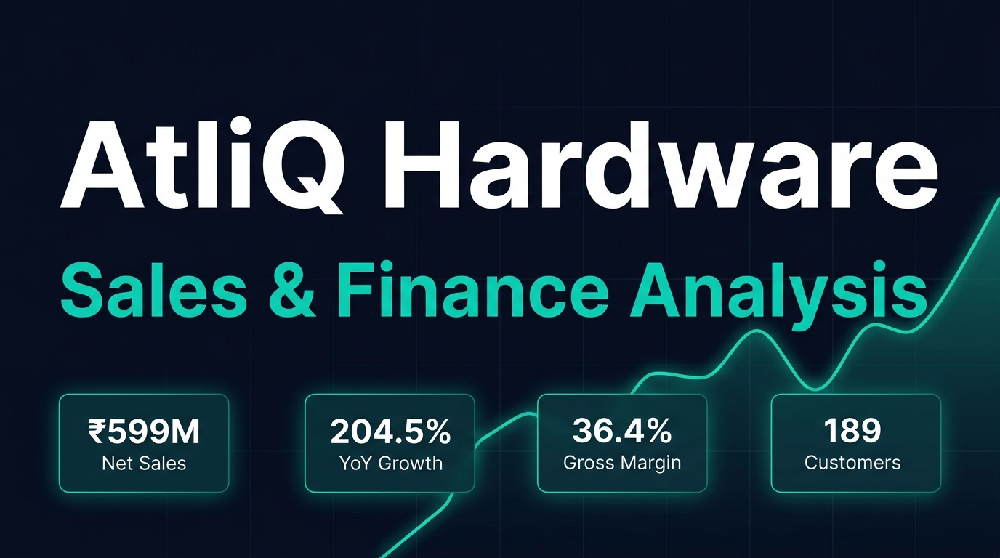

<div align="center">



# 📊 AtliQ Hardware — Sales & Finance Analysis

[](https://www.microsoft.com/en-us/microsoft-365/excel)
[](https://learn.microsoft.com/en-us/power-query/)
[](https://support.microsoft.com/en-us/office/create-a-pivottable-to-analyze-worksheet-data)
[](https://learn.microsoft.com/en-us/dax/)
[](.)
[](LICENSE)

> A comprehensive **Sales & Finance Analytics** project for **AtliQ Hardware** — a global hardware manufacturer. Built entirely in **Microsoft Excel** using Power Query, Pivot Tables, DAX formulas, and conditional formatting to derive actionable business insights across FY2019–FY2021.

**[📈 Live Dashboard →](https://your-github-username.github.io/sales_-_finance_analysis_of-_AtliQ/)** &nbsp; | &nbsp; **[📂 View Reports →](reports/)** &nbsp; | &nbsp; **[📊 Download Excel →](excel/AtliQ_Hardware_Sales_Finance_Analysis.xlsx)**

</div>

---

## 📑 Table of Contents

- [🏢 Project Overview](#-project-overview)
- [🎯 Business Objectives](#-business-objectives)
- [📁 Repository Structure](#-repository-structure)
- [📊 Key Insights & KPIs](#-key-insights--kpis)
- [🔍 Reports Covered](#-reports-covered)
- [🛠️ Excel Skills & Tools Used](#️-excel-skills--tools-used)
- [📂 Dataset Description](#-dataset-description)
- [🚀 How to Use](#-how-to-use)
- [🤝 Connect & Contribute](#-connect--contribute)

---

## 🏢 Project Overview

**AtliQ Hardware** is a multinational company that manufactures and sells computer hardware and peripherals — including PCs, mice, printers, and more — across **23 markets** worldwide through Retailers, Direct stores, and Distributors.

This project performs an **end-to-end Sales & Finance Analysis** using Microsoft Excel to help the business understand:
- How sales have grown year-over-year
- Which markets, customers, and products are performing best
- Where the company stands vs. its sales targets
- The financial health through Gross Margin analysis

---

## 🎯 Business Objectives

| # | Business Question | Report |
|---|---|---|
| 1 | How did each customer perform in terms of Net Sales across FY2019–FY2021? | Customer Net Sales Performance |
| 2 | Which markets achieved their 2021 sales targets? | Market vs. Target Report |
| 3 | What are the Top 10 products by sales growth? | Top Products Report |
| 4 | What is the Profit & Loss (P&L) by Fiscal Year? | P&L by Fiscal Year |
| 5 | What is the P&L by Market (Country)? | P&L by Market |
| 6 | What is the Gross Margin % by Quarter for each sub-zone? | GM% by Sub-Zone & Quarter |

---

## 📁 Repository Structure

```
sales_-_finance_analysis_of-_AtliQ/
│
├── 📂 excel/                          # Core Excel workbooks
│   ├── AtliQ_Hardware_Sales_Finance_Analysis.xlsx   # Main analysis workbook
│   └── add_finance_data.xlsx                        # Supplementary finance data
│
├── 📂 data/                           # Raw & processed datasets
│   ├── raw/                           # Source CSV files
│   │   ├── dim_customer.csv           # Customer dimension (189 customers)
│   │   ├── dim_market.csv             # Market dimension (23 markets)
│   │   ├── dim_product.csv            # Product dimension (298 products)
│   │   ├── fact_sales_monthly.csv     # Monthly sales transactions
│   │   ├── fact_sales_monthly_with_cost.csv  # Sales with COGS data
│   │   └── ns_targets_2021.csv        # FY2021 Net Sales targets by market
│   └── processed/
│       └── dashboard_summary.json     # Aggregated KPIs for the dashboard
│
├── 📂 reports/                        # Exported PDF reports
│   ├── AtliQ_Customer_Sales_Analysis.pdf    # Customer performance report
│   └── AtliQ_Target_Report_21.pdf           # FY2021 target vs. actual report
│
├── 📂 docs/                           # GitHub Pages interactive dashboard
│   └── index.html                     # Live dashboard (Chart.js powered)
│
├── 📂 analysis/                       # Python helper scripts
│   └── generate_insights.py          # Script to generate dashboard_summary.json
│
├── 📂 assets/                         # Images & visual assets
│   └── banner.jpg                    # Project banner
│
├── .gitignore
├── LICENSE
└── README.md
```

---

## 📊 Key Insights & KPIs

| Metric | FY2019 | FY2020 | FY2021 |
|--------|--------|--------|--------|
| 💰 **Net Sales** | ₹87.5M | ₹196.7M | **₹598.9M** |
| 📈 **YoY Growth** | — | 124.8% | **204.5%** |
| 💹 **Gross Margin %** | 41.4% | 37.3% | **36.4%** |
| 🌍 **Markets** | — | — | **23** |
| 👥 **Customers** | — | — | **189** |
| 📦 **Products Sold** | — | — | **260** |
| 🛒 **Transactions** | — | — | **799,962** |

### 🏆 Top 5 Customers by Net Sales (FY2021)

| Rank | Customer | Net Sales | YoY Growth |
|------|----------|-----------|------------|
| 🥇 | **Amazon** | ₹82.1M | +118.9% |
| 🥈 | **Atliq e Store** | ₹53.0M | +123.8% |
| 🥉 | **AltiQ Exclusive** | ₹52.8M | +238.6% |
| 4 | Sage | ₹20.7M | +221.5% |
| 5 | Flipkart | ₹19.3M | +131.0% |

### 🌍 Regional Performance (FY2021)

| Region | Net Sales | Market Share |
|--------|-----------|--------------|
| 🌏 **APAC** | ₹336.3M | 56.2% |
| 🇪🇺 **EU** | ₹139.7M | 23.3% |
| 🌎 **NA** | ₹122.8M | 20.5% |

### 🎯 Target vs. Actual (FY2021)

> ⚠️ All 23 markets missed their 2021 Net Sales targets, with an average variance of **-9.17%**. The largest misses were in Poland (-18.1%), Canada (-14.5%), and Spain (-14.2%).

---

## 🔍 Reports Covered

### 📈 Sales Reports

**1. Customer Net Sales Performance**
- Net Sales for each customer: FY2019, FY2020, FY2021
- Year-over-Year growth % (FY20 vs FY19, FY21 vs FY20)
- Identifies top-performing and declining customers

**2. Market vs. Target Report (FY2021)**
- Actual Net Sales vs. budgeted targets per market
- Variance % for each of the 23 markets
- Highlights underperformance vs. expectations

**3. Top 10 Products Report**
- Products with highest sales growth FY20 → FY21
- Identifies star products and rising categories

**4. Division-Level Sales**
- Peripherals & Accessories · Personal Computers · Networking & Storage
- Net Sales & Gross Margin % by division

### 💰 Finance Reports

**5. P&L by Fiscal Year**
- Net Sales, COGS, Gross Profit, GM%
- Trend across FY2019, FY2020, FY2021

**6. P&L by Market**
- Country-level profitability breakdown
- Identifies most and least profitable markets

**7. Gross Margin % by Sub-Zone & Quarter**
- Quarterly GM% trends for each regional sub-zone
- Detects seasonal and geographic margin patterns

**8. Top & Bottom Products by Qty Sold**
- Top 5 and Bottom 5 products by quantity
- Helps with inventory and product strategy decisions

---

## 🛠️ Excel Skills & Tools Used

| Category | Tools / Features |
|----------|-----------------|
| **Data Preparation** | Power Query (ETL), Data Cleaning, Data Modeling |
| **Data Modeling** | Star Schema, Table Relationships, Lookup Functions |
| **Calculations** | DAX Measures, SUMIF, VLOOKUP, INDEX/MATCH |
| **Fiscal Calendar** | Custom fiscal year logic (Sep–Aug) using date tables |
| **Pivot Analysis** | Pivot Tables, Pivot Charts, Slicers, Timelines |
| **Finance Metrics** | Net Sales, COGS, Gross Profit, Gross Margin % |
| **Visualization** | Conditional Formatting, Heatmaps, Sparklines, Charts |
| **Reporting** | PDF Export, Print-ready layouts, Professional styling |

---

## 📂 Dataset Description

| File | Description | Rows |
|------|-------------|------|
| `dim_customer.csv` | Customer master: name, market, platform, channel | 189 |
| `dim_market.csv` | Market master: country, sub-zone, region | 23 |
| `dim_product.csv` | Product master: segment, division, category, variant | 298 |
| `fact_sales_monthly.csv` | Monthly transaction facts: date, customer, product, qty, price | ~800K |
| `fact_sales_monthly_with_cost.csv` | Same as above + manufacturing cost (COGS) | ~800K |
| `ns_targets_2021.csv` | FY2021 Net Sales targets by market | 23 |

---

## 🚀 How to Use

### Option 1 — Open the Excel Workbook (Recommended)
```
1. Download: excel/AtliQ_Hardware_Sales_Finance_Analysis.xlsx
2. Enable Macros & Content when prompted
3. Navigate using the sheet tabs at the bottom
4. Use Slicers to filter by Year, Region, or Channel
```

### Option 2 — View the Live Dashboard
```
Visit: https://your-github-username.github.io/sales_-_finance_analysis_of-_AtliQ/
```

### Option 3 — View PDF Reports
```
Browse: reports/
  ├── AtliQ_Customer_Sales_Analysis.pdf
  └── AtliQ_Target_Report_21.pdf
```

---

## 🤝 Connect & Contribute

Made with ❤️ and lots of Excel formulas 📐

[](https://linkedin.com/in/your-profile)
[](https://github.com/your-github-username)

⭐ **Star this repo if you found it helpful!**

---

*This project was completed as part of the Codebasics Data Analytics Bootcamp guided by [Codebasics](https://codebasics.io)*
